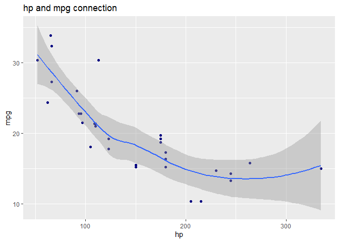
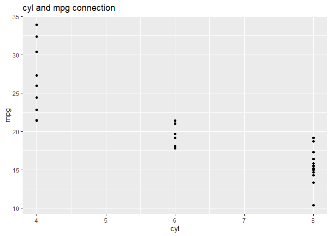
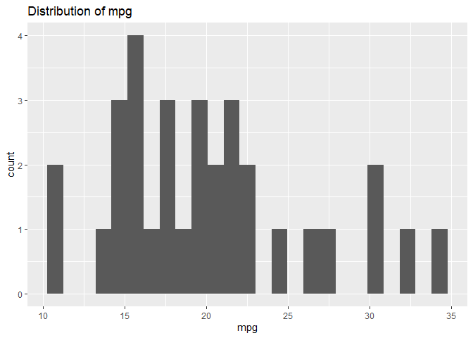
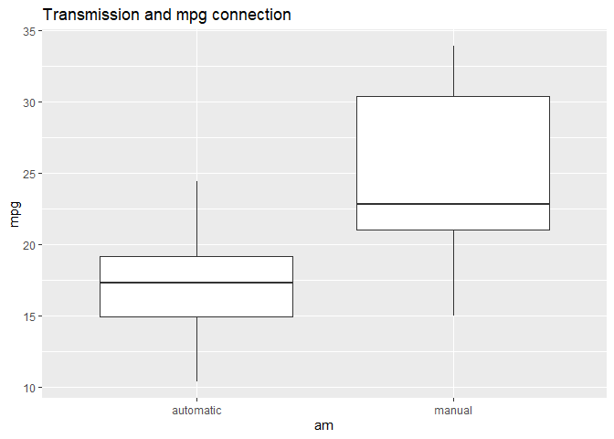
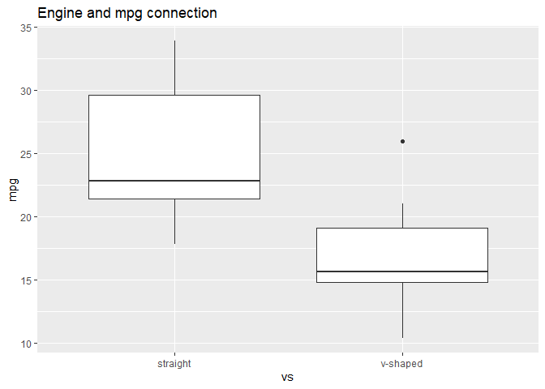
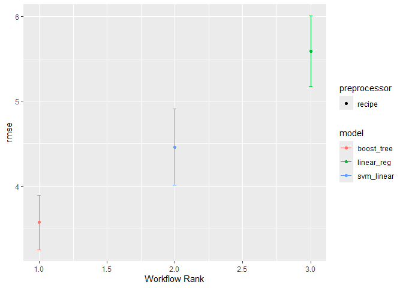
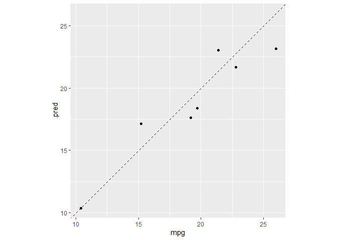

# mtcars
Nusa Seldi

- [Introduction](#introduction)
- [Import Library](#import-library)
- [Load the data](#load-the-data)
- [Preprocessing](#preprocessing)
- [Explore the data](#explore-the-data)
- [Build a Model](#build-a-model)
- [Evaluate the model](#evaluate-the-model)

## Introduction

Motor Trend Car Road Tests (mtcars) contains the data from *Motor Trend*
US magazine about fuel consumption and other aspects of automobile
design and performance for 32 automobiles (1973-74 models).

This time, our goal is to predict the Miles per gallon (mpg) of 32
automobiles. We will utilize tidymodels’ workflow_set function to build
several regression models at once: linear model, support vector machine,
and xgboost.

## Import Library

``` r
library(tidyverse)
library(tidymodels)
library(skimr)
```

## Load the data

``` r
car_df <- mtcars

glimpse(car_df)
```

    Rows: 32
    Columns: 11
    $ mpg  <dbl> 21.0, 21.0, 22.8, 21.4, 18.7, 18.1, 14.3, 24.4, 22.8, 19.2, 17.8,…
    $ cyl  <dbl> 6, 6, 4, 6, 8, 6, 8, 4, 4, 6, 6, 8, 8, 8, 8, 8, 8, 4, 4, 4, 4, 8,…
    $ disp <dbl> 160.0, 160.0, 108.0, 258.0, 360.0, 225.0, 360.0, 146.7, 140.8, 16…
    $ hp   <dbl> 110, 110, 93, 110, 175, 105, 245, 62, 95, 123, 123, 180, 180, 180…
    $ drat <dbl> 3.90, 3.90, 3.85, 3.08, 3.15, 2.76, 3.21, 3.69, 3.92, 3.92, 3.92,…
    $ wt   <dbl> 2.620, 2.875, 2.320, 3.215, 3.440, 3.460, 3.570, 3.190, 3.150, 3.…
    $ qsec <dbl> 16.46, 17.02, 18.61, 19.44, 17.02, 20.22, 15.84, 20.00, 22.90, 18…
    $ vs   <dbl> 0, 0, 1, 1, 0, 1, 0, 1, 1, 1, 1, 0, 0, 0, 0, 0, 0, 1, 1, 1, 1, 0,…
    $ am   <dbl> 1, 1, 1, 0, 0, 0, 0, 0, 0, 0, 0, 0, 0, 0, 0, 0, 0, 1, 1, 1, 0, 0,…
    $ gear <dbl> 4, 4, 4, 3, 3, 3, 3, 4, 4, 4, 4, 3, 3, 3, 3, 3, 3, 4, 4, 4, 3, 3,…
    $ carb <dbl> 4, 4, 1, 1, 2, 1, 4, 2, 2, 4, 4, 3, 3, 3, 4, 4, 4, 1, 2, 1, 1, 2,…

``` r
skim(car_df)
```

|                                                  |        |
|:-------------------------------------------------|:-------|
| Name                                             | car_df |
| Number of rows                                   | 32     |
| Number of columns                                | 11     |
| \_\_\_\_\_\_\_\_\_\_\_\_\_\_\_\_\_\_\_\_\_\_\_   |        |
| Column type frequency:                           |        |
| numeric                                          | 11     |
| \_\_\_\_\_\_\_\_\_\_\_\_\_\_\_\_\_\_\_\_\_\_\_\_ |        |
| Group variables                                  | None   |

Data summary

**Variable type: numeric**

| skim_variable | n_missing | complete_rate |   mean |     sd |    p0 |    p25 |    p50 |    p75 |   p100 | hist  |
|:--------------|----------:|--------------:|-------:|-------:|------:|-------:|-------:|-------:|-------:|:------|
| mpg           |         0 |             1 |  20.09 |   6.03 | 10.40 |  15.43 |  19.20 |  22.80 |  33.90 | ▃▇▅▁▂ |
| cyl           |         0 |             1 |   6.19 |   1.79 |  4.00 |   4.00 |   6.00 |   8.00 |   8.00 | ▆▁▃▁▇ |
| disp          |         0 |             1 | 230.72 | 123.94 | 71.10 | 120.83 | 196.30 | 326.00 | 472.00 | ▇▃▃▃▂ |
| hp            |         0 |             1 | 146.69 |  68.56 | 52.00 |  96.50 | 123.00 | 180.00 | 335.00 | ▇▇▆▃▁ |
| drat          |         0 |             1 |   3.60 |   0.53 |  2.76 |   3.08 |   3.70 |   3.92 |   4.93 | ▇▃▇▅▁ |
| wt            |         0 |             1 |   3.22 |   0.98 |  1.51 |   2.58 |   3.33 |   3.61 |   5.42 | ▃▃▇▁▂ |
| qsec          |         0 |             1 |  17.85 |   1.79 | 14.50 |  16.89 |  17.71 |  18.90 |  22.90 | ▃▇▇▂▁ |
| vs            |         0 |             1 |   0.44 |   0.50 |  0.00 |   0.00 |   0.00 |   1.00 |   1.00 | ▇▁▁▁▆ |
| am            |         0 |             1 |   0.41 |   0.50 |  0.00 |   0.00 |   0.00 |   1.00 |   1.00 | ▇▁▁▁▆ |
| gear          |         0 |             1 |   3.69 |   0.74 |  3.00 |   3.00 |   4.00 |   4.00 |   5.00 | ▇▁▆▁▂ |
| carb          |         0 |             1 |   2.81 |   1.62 |  1.00 |   2.00 |   2.00 |   4.00 |   8.00 | ▇▂▅▁▁ |

It can be seen that the dataset consists of 32 automobiles with 11
variables. All data types are numeric and there are no missing values in
the dataset.

## Preprocessing

For preprocessing, we will change two variables, am (transmission) and
vs (engine). We will transform the format to factor and also change the
labels of the values.

``` r
car_df <- car_df |> 
  mutate( am = case_match(am, 1 ~ "manual", .default = 'automatic'),
          vs = case_match(vs, 1 ~ 'straight', .default = 'v-shaped'),
          am = as.factor(am),
          vs = as.factor(vs))
```

## Explore the data











## Build a Model

Before we build a model, we will divide the data into training set and
test set with a ratio of 80:20. For feature engineering, we will
normalize the data for numeric data and create dummy variables for
nominal data.

``` r
set.seed(11)
car_split <- initial_split(car_df, prop = 0.8)
car_train <- training(car_split)
car_test <- testing(car_split)

set.seed(80)
car_fold <- bootstraps(car_train, times = 10)

car_recipe <- recipe(mpg ~ ., data = car_train) |> 
  step_normalize(all_numeric_predictors()) |> 
  step_dummy(all_nominal_predictors())

lm_spec <- linear_reg() |> 
  set_mode('regression') |> 
  set_engine('stan')

xgb_spec <- boost_tree() |> 
  set_mode('regression') |> 
  set_engine('xgboost')

svm_spec <- svm_linear() |> 
  set_mode('regression') |> 
  set_engine('kernlab')

wf_set <- workflow_set(preproc = list(basic = car_recipe),
                       models = list(lm = lm_spec,
                                     xgboost = xgb_spec,
                                     svm = svm_spec))

wf_set_fit <- workflow_map(wf_set,
                           resamples = car_fold,
                           seed = 123,
                           control = control_grid(save_pred = TRUE, save_workflow = TRUE ,parallel_over = "everything"))
```

## Evaluate the model

For the evaluation, we will use metric *rmse* to estimate our model
performance. From the three models, we choose the best model according
to metric rmse and fit the final model to the training set and evaluate
the test set.

``` r
wf_set_fit |> collect_metrics(summarize = T) 
```

    # A tibble: 6 × 9
      wflow_id      .config     preproc model .metric .estimator  mean     n std_err
      <chr>         <chr>       <chr>   <chr> <chr>   <chr>      <dbl> <int>   <dbl>
    1 basic_lm      Preprocess… recipe  line… rmse    standard   5.59     10  0.253 
    2 basic_lm      Preprocess… recipe  line… rsq     standard   0.433    10  0.0540
    3 basic_xgboost Preprocess… recipe  boos… rmse    standard   3.57     10  0.193 
    4 basic_xgboost Preprocess… recipe  boos… rsq     standard   0.728    10  0.0265
    5 basic_svm     Preprocess… recipe  svm_… rmse    standard   4.46     10  0.272 
    6 basic_svm     Preprocess… recipe  svm_… rsq     standard   0.584    10  0.0486

``` r
wf_set_fit |> 
  rank_results() |> 
  filter(.metric == 'rmse')
```

    # A tibble: 3 × 9
      wflow_id      .config     .metric  mean std_err     n preprocessor model  rank
      <chr>         <chr>       <chr>   <dbl>   <dbl> <int> <chr>        <chr> <int>
    1 basic_xgboost Preprocess… rmse     3.57   0.193    10 recipe       boos…     1
    2 basic_svm     Preprocess… rmse     4.46   0.272    10 recipe       svm_…     2
    3 basic_lm      Preprocess… rmse     5.59   0.253    10 recipe       line…     3

``` r
autoplot(wf_set_fit, rank_metric = 'rmse', metric = 'rmse', select_best = TRUE)
```



``` r
best_result <- wf_set_fit |> 
  extract_workflow_set_result(id = 'basic_xgboost') |> 
  select_best(metric = 'rmse')

xgboost_result <- wf_set_fit |> 
  extract_workflow('basic_xgboost') |> 
  finalize_workflow(best_result) |> 
  last_fit(split = car_split)

collect_metrics(xgboost_result) 
```

    # A tibble: 2 × 4
      .metric .estimator .estimate .config             
      <chr>   <chr>          <dbl> <chr>               
    1 rmse    standard       1.69  Preprocessor1_Model1
    2 rsq     standard       0.888 Preprocessor1_Model1

``` r
predicted <- xgboost_result |> 
  collect_predictions()

predicted |> 
  select(.pred, mpg)
```

    # A tibble: 7 × 2
      .pred   mpg
      <dbl> <dbl>
    1  21.7  22.8
    2  17.6  19.2
    3  17.1  15.2
    4  10.4  10.4
    5  23.2  26  
    6  18.4  19.7
    7  23.0  21.4

``` r
predicted |> 
  ggplot(aes(x = mpg, y = .pred)) +
  geom_point() +
  geom_abline(lty = 2) +
  coord_obs_pred()
```


